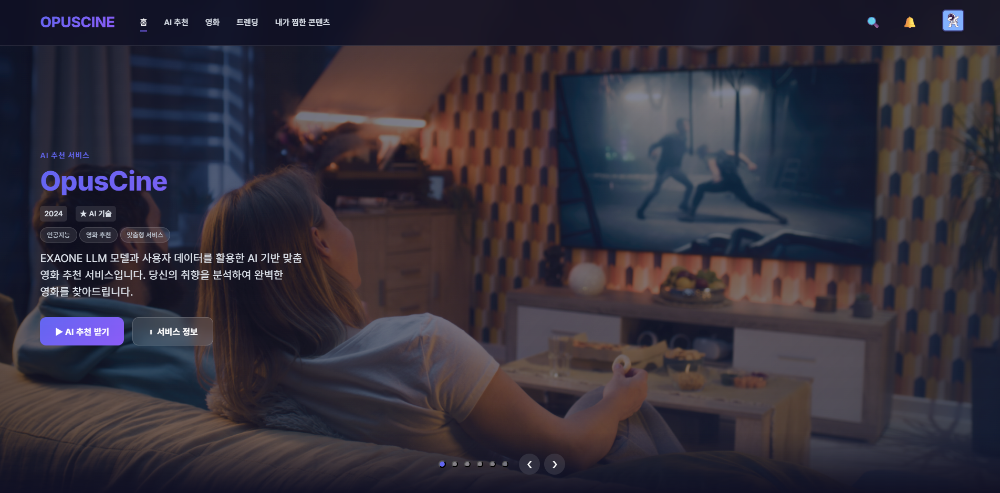
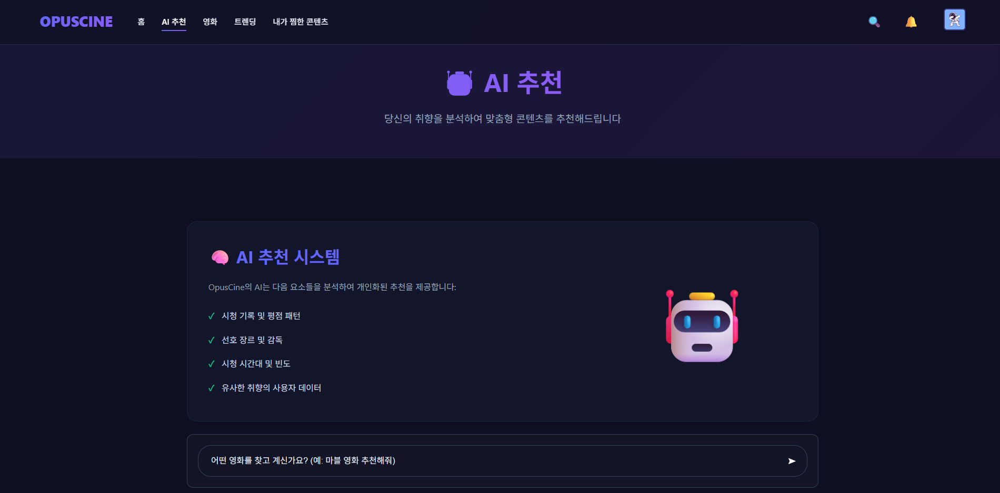
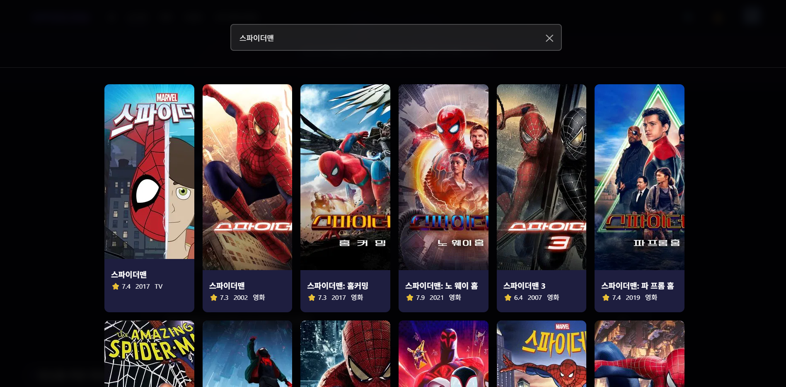
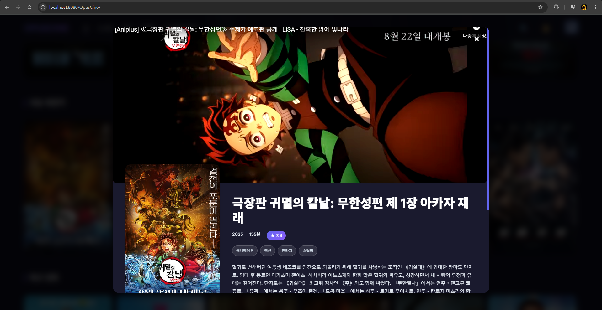

# 🎬 OpusCine – AI 추천 영화 플랫폼

> 한국어 특화 LLM(Exaone 3.5)을 활용한 **대화형 영화 추천 서비스**  
> Netflix 스타일 UI/UX와 **실시간 채팅 기능**으로 단순 추천을 넘어 **소셜 기반 스트리밍 경험**을 제공합니다.

---

## 🎥 시연 영상
<video src="assets/demo.mp4" controls width="600"></video>  
👉 영상이 재생되지 않을 경우 [여기](assets/demo.mp4)를 클릭하세요.

---

## 📸 스크린샷
> 프로젝트 주요 화면 스크린샷을 추가하세요.  
예시:

---

## 🗂 프로젝트 개요
- **기간**: 2025.05 ~ 2025.07  
- **역할**:  
  - Python 기반 LLM 응답 처리 및 프롬프트 설계  
  - Cloudtype 연동 및 Linux 기반 LLM 서버 환경 구축  
  - TMDB API 연동 및 영화 정보 데이터 처리 로직 구현  
  - 프론트엔드(UI/UX) 작업 및 디자인  
  - Redis 캐싱 적용  

---

## 🚀 동기
OTT 서비스가 늘어나면서, 원하는 콘텐츠를 찾기 위해 여러 플랫폼을 이동해야 하는 불편함이 있습니다.  
OpusCine은 **TMDB API + LLM**을 활용해 한 곳에서 **개인 맞춤형 영화 추천과 OTT 연동**을 제공하고자 개발되었습니다.  

---

## ⚙️ 기술 스택

| 영역 | 기술 |
|------|------|
| **Backend** |    |
| **Frontend** |  |
| **Database & Cache** |   |
| **AI/ML** |    |
| **Infra** |    |

---

## 🔗 프로젝트 구조
- **Opuscine**: Spring 백엔드 + 프론트엔드  
- **Api-server**: TMDB API 서버  
- **Cloudtype-proxy**: Spring ↔ LLM 연결 프록시 서버  
- **LLM-server**: AI 추천 전용 서버  

---

## 🛠 설계 의도와 선택 기술

### 1. 프록시 서버, LLM 서버, API 서버를 분리한 이유
- Windows 환경에서 PyTorch 실행을 위해 Linux 기반 LLM 서버가 필요했습니다.  
- NGROK을 활용하여 **Spring → Proxy → NGROK → LLM** 구조를 설계했습니다.  
- TMDB API 요청 부하를 줄이기 위해 별도의 **api-server**를 두어 LLM 서버의 안정성을 확보했습니다.

### 2. 왜 Exaone을 사용했는가?
- 한국어 환경에 최적화된 LLM 모델이 필요했습니다.  
- Exaone 3.5는 한국어 대화형 AI 성능이 우수하여 본 프로젝트의 목적에 가장 적합했습니다.

### 3. Redis를 사용한 이유
- TMDB에서 가져온 OTT 링크 데이터를 반복 요청 시 빠르게 제공하기 위해 캐싱 구조를 도입했습니다.  
- Redis를 활용해 서버 부하를 줄이고, 사용자 응답 속도를 최적화했습니다.

---

## ✨ 주요 기능
- **AI 추천**: 대화형 LLM을 통한 맞춤형 영화 추천  
- **실시간 같이 보기**: Tomcat WebSocket 기반 동시 시청 + 채팅  
- **소셜 로그인**: Google, Naver 계정 로그인 지원  
- **검색 & 필터**: 제목/장르/배우 기반 정교한 검색  
- **OTT 연동**: Proxy 서버 기반 외부 OTT 상세 페이지 연결  
- **시청 기록 관리**: Redis 캐싱으로 빠른 기록 확인  

---

## 👥 팀원
- **박원빈** – Python LLM 처리, 서버 구축, 프론트엔드  
- **정혜린** – Spring 백엔드, DB 설계  

---

## 📌 배운 점
- **양자화(Quantization)**를 통해 대형 LLM을 제한된 VRAM 환경에서 구동  
- **Fallback 설계**로 GPU 부족 시 CPU로 전환하여 서비스 연속성 확보  
- **Prompt Engineering**을 통한 모델 이해도 향상  
- **Redis 캐싱**으로 사용자 경험 속도 최적화  

---
